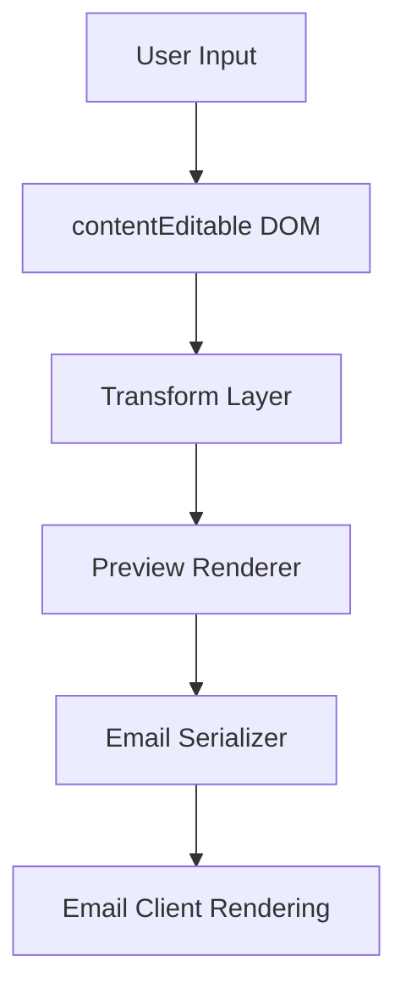
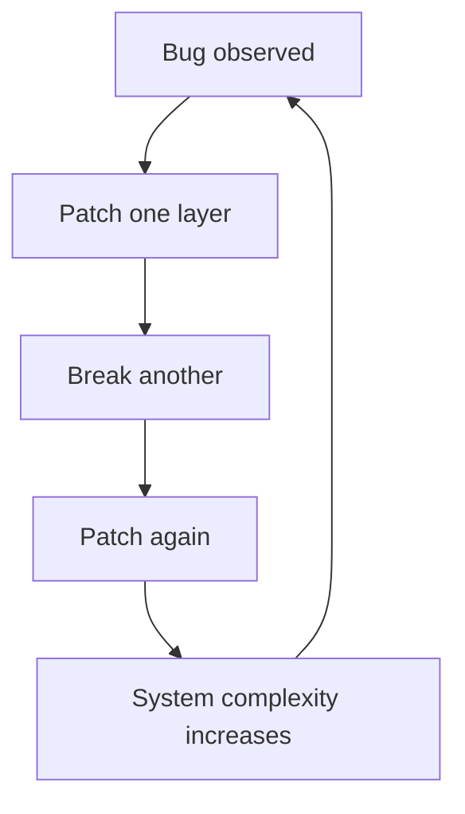
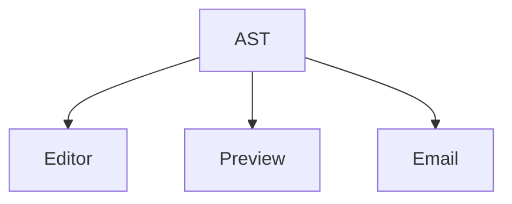

---

# Six PRs, One Bug: What AI Agents Actually Get Wrong

*Or: how a trivial formatting bug exposed systemic failure modes in autonomous code generation.*

---

## Context

Most product decisions are invisible—until they aren’t.

At platform scale, small inconsistencies don’t stay small—they compound across rendering environments, devices, and user expectations.

This bug came from a smaller system: a billing email editor.

But the failure mode is identical to what happens in large distributed systems.

---

## The System



### Invariant

```
Editor = Preview = Email
```

### Reality

```
Editor ≠ Preview ≠ Email
```

---

## The Bug

Input:

```text
Hello John,

**Thank you** for your payment.

Payment methods:
https://venmo.com/u/nathanPayne
```

---

## What the User Actually Sees

### Editor


- Looks correct
- No unexpected formatting

---

### Preview


- Extra spacing
- Unexpected bolding

---

### Sent Email


- Different again
- Final output does not match upstream states

---

## Key Observation

```
Same input → three different outputs
```

This is not a styling issue.

This is a **pipeline integrity failure**.

---

## Failure Mode #1: CSS Patching a Data Problem

```css
.preview p {
  margin-bottom: 8px;
}
```

Fixes preview only.

Breaks system consistency.

---

## Failure Mode #2: Regex Parsing

```js
text.replace(/\*\*(.*?)\*\*/g, '<strong>$1</strong>')
```

Fails on nesting, creates malformed HTML.

---

## Failure Mode #3: Divergent Render Paths

```js
preview.innerHTML = format(input);
email = sanitize(format(input));
```

Different outputs from same source.

---

## Failure Mode #4: DOM as Source of Truth

```js
editor.innerHTML
```

Non-deterministic, polluted structure.

---

## Failure Mode #5: Email Client Blindness

- CSS ignored
- HTML altered
- Rendering inconsistent

---

## Failure Mode #6: Patch Accumulation

```text
input
 → transform
 → sanitize
 → override
 → reprocess
```

Complexity increases.

No convergence.

---

## Failure Loop



---

## Correct Architecture



Single source of truth.

Deterministic outputs.

---

## What the Agents Missed

They optimized for:

```
Does preview look right?
```

Instead of:

```
Does the system stay consistent?
```

---

## The Real Problem

Not formatting.

Not rendering.

**Missing system boundaries.**

---

## Practical Takeaway

Use AI agents for:

- Local transformations
- Scoped edits

Do not rely on them for:

- System modeling
- Cross-layer invariants

---

## Closing

Six PRs.

One bug.

Zero fixes.

Because the system—not the code—was never understood.

---

## Signature

Nathan Payne  
Product Manager, Disney+, Hulu, ESPN  
San Francisco  

https://nathanpayne.com
