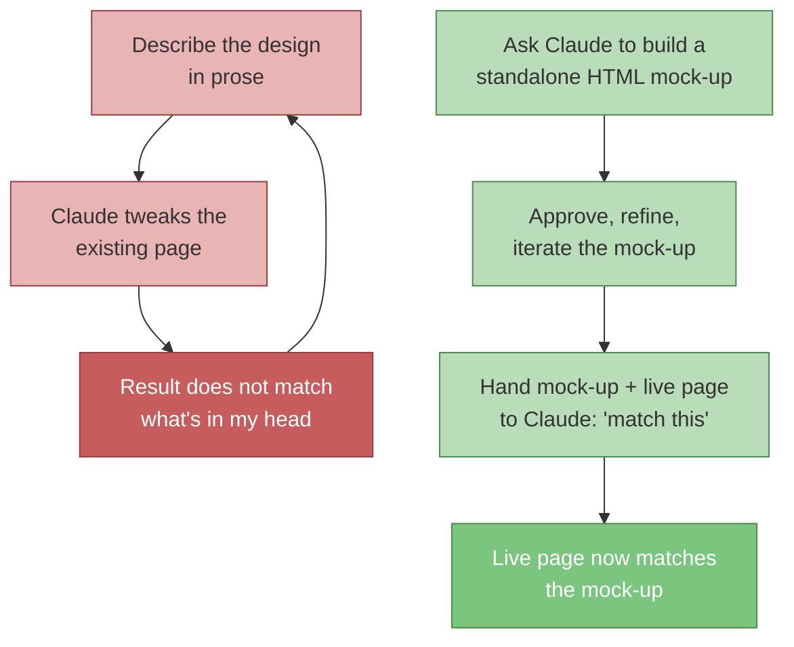

I am not an engineer. I am a product manager. When I have an opinion about what something should look like, the opinion is usually correct in the sense that I can recognize the right answer when I see it, and usually unhelpful in the sense that I cannot get the words "more Mondrian, less LinkedIn" to land as a CSS diff. For the first month of working on nathanpayne.com with Claude Code, that translation problem was the entire job. I knew what I wanted. I could not get Claude to ship it.

What unstuck me was not a better prompt or a smarter model. It was a different artifact. I stopped describing the design and started prototyping it. The pattern is small enough to state in one sentence: ask Claude to build a standalone HTML mock-up first, approve the mock-up, then hand the mock-up and the existing page back to Claude and tell it to make the page look like the mock-up. That is the whole post. The rest is why the obvious moves do not work and why this one does.


## What I tried first, and why none of it worked

The natural first move, if you are a PM who has used AI tools for anything else, is to point Claude at the existing page and describe the change in prose. "Make the blog index more Mondrian. Use red, blue, yellow, and black. Asymmetric grid. Featured post should get the largest cell." I tried this. The agent did things. The things were not the thing I wanted. The grid was closer to a Bootstrap card list with a red border than to a De Stijl composition, and there was no good language to bridge that gap. Saying "more Mondrian" louder did not help. Saying "look at the homepage" helped a little, because the homepage was already a Mondrian grid, but the agent would then mostly copy the homepage exactly instead of designing a new composition that drew from the same idiom.

The second move was diagrams. I sketched the grid I wanted in a notebook, photographed it, and pasted it into the chat. Claude described the diagram back to me with impressive fidelity—"a 3×3 grid where the top-left cell spans two columns and the bottom-right is a smaller red square"—and then produced code that did not match what it had described. The vision model and the code model were not the same model in any practical sense. Reading the picture and producing the page were two different jobs, and the handoff between them was lossy.

The third move was annotated screenshots. I would screenshot the existing page in Figma, drop arrows and red boxes on it with notes like "this column should be 22% wide and red" or "vertical 'LATEST' label here, blue background," and paste that in. This was the worst of all the failure modes, because the agent would diligently address each annotation as a local change rather than understanding the annotations as a description of a target state. I would end up with the red box where I said the red box should be, but the rest of the layout was untouched, because the agent had treated the annotated screenshot as a punch list rather than a spec.

The pattern I kept missing is now obvious to me. All three of these inputs—prose, diagrams, annotated screenshots—asked the agent to do art criticism in its head and then write code that matched. Coding agents are not unusually good at art criticism. They are unusually good at reading a file and producing a file that resembles it. I had been giving them the wrong kind of artifact.

The two loops, side by side—the describe-it loop that kept failing, and the prototype-it loop that worked:



## The pivot: build the mock-up first

The unlock was [issue #75](https://github.com/nathanjohnpayne/nathanpaynedotcom/issues/75), which asked for a Mondrian grid layout for the blog index. Instead of describing the design I wanted, I asked Claude to build a few candidate HTML mock-ups, each in its own self-contained file in a `mockups/` directory at the repo root. No Astro. No Content Collections. No build pipeline. Just one HTML file per option, with inline CSS, that you could open in a browser and see exactly what the design looked like at desktop and on mobile.

That request worked instantly. Claude produced four files—`A-cards-grid.html`, `B-de-stijl-index.html`, `C-composition-margins.html`, `D-minimal.html`—and I picked Mockup B. The mock-up had a featured post cell in the top left, a red accent block in the top middle, a blue accent block with a vertical "LATEST" label on the right, and yellow and cream blocks farther down. It collapsed cleanly to a single column on mobile. Nothing about the file was production code. The page had no real posts in it, no analytics, no SEO meta, no schema. It was a picture you could open in a browser.

Then I did the move that mattered. I opened the issue and wrote, in the design section:

> Mockup B from `mockups/B-de-stijl-index.html`. Key characteristics: featured post in the largest cell (top-left), spanning multiple rows—echoes the red panel on the homepage. Accent blocks: red (top-mid), blue with vertical "Latest" label (top-right, spanning rows), yellow (bottom-right). Older posts fill progressively smaller cells. RSS CTA: neutral block with subscribe link. 9px black grid lines between all cells.

Then I asked Claude to read both `mockups/B-de-stijl-index.html` and `src/pages/blog/index.astro`, and make the live page render like the mock-up. That kicked off [PR #77](https://github.com/nathanjohnpayne/nathanpaynedotcom/pull/77), which replaced a `blog-card-list` vertical list with a true Mondrian row grid. The commit message says it plainly: "De Stijl Mondrian row grid from mockup." The first round of the PR landed close enough to the mock-up that the remaining work was line-thickness and hover states, not layout. The thing I had been failing to produce in prose for weeks shipped in an afternoon.

The same pattern produced [PR #76](https://github.com/nathanjohnpayne/nathanpaynedotcom/pull/76) for the individual blog post template, driven by [issue #74](https://github.com/nathanjohnpayne/nathanpaynedotcom/issues/74) and Mockup C at `mockups/C-composition-margins.html`. The blog post you are reading right now—with the three-column canvas, the accent margin on the left, the sticky sidebar with the diagram on the right, the breadcrumbs and metadata in a horizontal accent bar above the body—is rendered by the layout that came out of that mock-up.

## Why the same trick worked for the 404 page

The 404 page, shipped in [PR #90](https://github.com/nathanjohnpayne/nathanpaynedotcom/pull/90) and refined across [PR #91](https://github.com/nathanjohnpayne/nathanpaynedotcom/pull/91), [PR #92](https://github.com/nathanjohnpayne/nathanpaynedotcom/pull/92), and a couple of small follow-up commits, took the same shape. The difference is that the prototype was not something Claude built for me. It was [Jen Simmons' Mondrian CSS Grid CodePen](https://codepen.io/jensimmons/pen/JJpGgw)—a public, self-contained, viewable example of exactly the asymmetric grid composition I wanted. The CSS comment in `src/styles/global.css` calls it out by name:

```css
/* ── 404 Page: Mondrian Grid ────
   Asymmetric grid inspired by Jen Simmons' Mondrian CSS Grid CodePen.
   Content cell spans multiple tracks; decorative blocks fill remaining cells.
   Collapses to single column on mobile with blocks hidden. ── */
```

The workflow was identical to the blog mock-ups. Hand Claude a working HTML reference. Hand it the existing 404 page, which at that point did not exist as a page at all (Firebase was rewriting all 404s to the SPA shell). Ask it to wire up the new page using the reference as the visual target. The asymmetric grid in `404.astro` today—`.error-shell`, `.error-mondrian`, the `.e-block` decorative cells in red, yellow, blue, black, and cream, the content cell spanning columns 2 through 7—is recognizably the CodePen's composition, restyled with the site's tokens and dropped into the Astro layout.

What I want to note here is that the reference does not have to be something Claude produced. It just has to be something Claude can read. A working HTML file on disk, a public CodePen URL, a Figma file exported to HTML—any of those is a better input than a description of the same design, because all of them give the agent a concrete artifact to anchor on.

## Why the same trick worked on an app: the FFB template editor

Everything I have described so far happened on this portfolio site. The pattern also held up in a completely different codebase. [Friends & Family Billing](/projects/friends-and-family-billing/) (FFB) is the app I built to handle utility splits in my household. The invoicing tab, where a user authors the email template that goes out with each invoice, needed a serious visual overhaul. The original version was a `contentEditable` div with seven separate chip buttons for inserting tokens, a stacked preview that pushed the save button below the fold, and inconsistent typography between the subject line and the body.

I tried describing the redesign in prose first, and got the same "tweaks the wrong thing" result the blog index had given me. So I switched modes. I asked Claude to build a self-contained HTML mock-up of the target editor: a single card containing the subject row, a unified chip bar, the formatting toolbar, the body editor, and a sticky save footer; pill-shaped Edit/Preview tabs above the card; an amber dot as the dirty-state indicator. The mock-up was static. No TipTap, no React, no token logic. Just HTML and CSS showing what the final layout should look like.


Then I handed Claude the mock-up and the live `InvoicingTab.jsx`, `TemplateEditor.css`, and `shell.css` files, and asked it to make the live editor match the mock-up. The work landed as commit [`20dcb32`](https://github.com/nathanjohnpayne/friends-and-family-billing/commit/20dcb32), titled, literally, "fix: redesign editor layout to match mockup and fix editability." The commit message enumerates eight design items—card layout, unified chip bar, pill-shaped tab bar, toolbar separator pipes, sticky save footer with "Last saved X ago," redesigned Preview tab with metadata grid, footer-positioned send button—and every one of them traces back to a decision made in the mock-up rather than a sentence in a prompt.

The follow-up record on that commit is, in a way I did not plan, the most useful part of this example. The agent had pushed it directly to `main` without a PR, which triggered a policy violation review in [issue #145](https://github.com/nathanjohnpayne/friends-and-family-billing/issues/145). (That gap is closed now—[Mergepath](/projects/mergepath/) enforces GitHub branch protection on `main` across every repo, so a direct push to the default branch is rejected server-side rather than left to the agent's discretion.) The external review summary opens with this line: "Restructures the InvoicingTab editor to match the target mockup." Even my own multi-agent review system, reading the diff cold, described the work by reference to the mock-up. That is a reasonable test for whether a design has been specified well: if a reviewer who has never seen your prompts can read the code and immediately name the target it was built against, the target is doing its job.

What this example added that the nathanpayne.com cases did not is the surrounding complexity of the file. The blog index is a static page that renders a list. The 404 page is a static layout. The FFB editor is a TipTap-backed rich-text editor with token nodes, slash-command autocomplete, migration logic, and persistence—there is plenty of room for the agent to get lost inside the existing system if it does not have a clear visual target. The mock-up kept the layout decision orthogonal to all of that. The agent could see exactly what the page should look like before it had to wrestle with the rest of the file.

The FFB editor has its own separate, painful story—the markdown bridge that the TipTap migration introduced eventually took six PRs to undo, which I wrote up in [Six PRs, One Bug](/blog/six-prs-one-bug-agent-failure-modes/). That is a different kind of problem, an architectural one. The mock-up-driven layout work and the markdown-bridge architecture problem coexisted in the same surface for weeks. They did not interact. A mock-up answers the question of what the page should look like; an invariant answers the question of what the system should do. Conflating those two kinds of questions in a single prompt is what made my earlier attempts hopeless. Splitting them—handing Claude a visual artifact for the visual question, and a system invariant for the system question—is what made both jobs tractable.

## Why the mock-up beats the screenshot

There are a few things going on at once when you swap a screenshot for an HTML mock-up. The most obvious is the medium. The screenshot is a picture; the HTML file is a file the agent can open and read. Pasting an annotated screenshot is asking the agent to do art criticism. Pasting an HTML file is asking it to do diffs. Coding agents are good at one of those and bad at the other, and the prompt should match the strength.

The second thing is the freedom of the prototyping context. A mock-up file in `mockups/` is not part of the production build. It has no integrations, no Content Collections schema to satisfy, no responsive test suite to pass, no Astro frontmatter to validate, no Firebase routing to respect. The agent can iterate on the mock-up purely as a visual artifact. Once it looks right, all of the production-side constraints—the schema, the routing, the responsive tests, the design tokens, the existing component vocabulary—become a re-implementation problem rather than a design problem. Those are two different skills and conflating them is exactly what was breaking my earlier attempts. When I pointed Claude at the existing page and asked for a redesign, it was trying to do both jobs at once, and the production constraints kept overriding the design instinct because the production constraints were the thing the agent could actually verify.

The third thing is that the mock-up becomes the spec. The mock-up is the final source of truth on what the page should look like, and you can refer to it by filename in the issue, in the PR description, and in subsequent prompts. The agent does not have to remember our conversation. It can re-read `mockups/B-de-stijl-index.html` on every prompt and re-verify against the file. Specs that live in prose drift with every prompt. Specs that live in HTML do not.

The fourth thing, and this one is closer to philosophy, is that a mock-up forces you to commit. If you are describing a design in prose, every prompt is a chance to change your mind. If you have asked Claude to ship a file that you have already opened in a browser and said yes to, the work shifts from "what do I want this to look like" to "why doesn't this match." The second question is much easier to make progress on, because the answer is a diff, not a vibe.

## What an HTML mock-up actually contains

The mock-ups Claude built for me are not Figma files dressed up as code. They are deliberately small and deliberately self-contained. A typical one in `mockups/B-de-stijl-index.html` is somewhere around two hundred to four hundred lines, with the full HTML, an inline `<style>` block, and a single representative example of each kind of content—one featured post, two standard posts, one placeholder. They use the same font stack and color tokens the production site uses, so the visual fidelity to the final page is high. They do not contain real content. They do not pull data from anywhere. They are not part of the build.

The point of those constraints is to keep the mock-up cheap. If the mock-up takes as long to build as the real page, it is not a prototype; it is a duplicate. The whole reason this workflow saves time is that you can spin three or four design candidates in an afternoon, pick one, throw the others away, and move on. The moment a mock-up acquires the rigor of production code, the cost-benefit collapses and you are back to making one expensive thing instead of three cheap ones.

The mock-up files themselves do not stay in the repo long term. Once the live page matches the mock-up, the mock-up is a historical artifact. Some of mine got committed; most got deleted as part of the implementation PR. That is fine. The mock-up's job is to exist while the design decision is open. Once the decision is made and the live page matches, the mock-up has served its purpose.

## What I generalized

The lesson here is not specific to Mondrian grids or to my site. It is a general claim about what kind of artifact a coding agent can usefully consume when the task is "make this thing look a particular way."

When the target is a visual outcome and the agent is going to express the work as code, the most useful input you can give the agent is a small, self-contained artifact in the same medium as the output—a file the agent can read, diff against, and re-verify on every prompt. Prose describes the target. Diagrams describe the target. Annotated screenshots describe the target. The mock-up *is* the target, and it is the only one of these that the agent can verify against without translating.

This generalizes beyond visual work. If the target is a CLI tool's behavior, the most useful input is a transcript of the exact command-line interaction you want, not a prose description of the help text. If the target is an API's response shape, the most useful input is a JSON example, not a list of fields. If the target is a tone of voice in a piece of UX copy, the most useful input is a paragraph of approved text in that voice, not a list of adjectives. The medium of the target should match the medium of the output. When they match, the agent's job is translation; when they do not, the agent's job is interpretation, and interpretation is where the work gets lost.

The trick was not getting Claude smarter at vision. It was getting myself smarter about what kind of artifact a coding agent can actually consume. The HTML mock-up is the spec. Everything else is a description of the spec, and descriptions of the spec are where the gap lives.

## Postscript: how I run this now

I do not write design prompts in prose anymore for anything that has a visual outcome. The workflow for every visual change to this site is now four steps and I run them in this order every time.

The first step is to ask Claude to build two or three candidate HTML mock-ups under `mockups/`, with inline styles, no build dependencies, viewable by double-clicking the file. The prompt is short: "Here is the page. Here is what I want to change. Build three self-contained HTML mock-ups in `mockups/` showing different approaches. Use the existing color tokens and font stack."

The second step is to open the candidates in a browser at desktop and mobile widths and pick one. If none of them is right, I ask for variants on the closest one. If two are close, I sometimes pick one for the live page and keep the other as a reference for a future change.

The third step is to write the issue. The issue references the mock-up file by path and calls out the key characteristics—grid columns, accent colors, responsive collapse breakpoint. The mock-up itself is the source of truth; the issue is the index into it.

The fourth step is to hand Claude the issue, the mock-up file, and the live page, and ask it to make the live page match the mock-up. The PR description references the mock-up. The reviewer can open the mock-up in a browser and the production page side by side and diff them visually. That is the only acceptance criterion that matters: do they match.

It is not a complicated workflow. It is barely a workflow. It is mostly a matter of writing one extra file before writing the prompt that used to fail. But the difference in output is the difference between a portfolio site that I can stand to look at and the cards-on-a-grey-background fallback I would have shipped if I had kept describing the design in prose. Mockup B and Mockup C are the only reason the blog has a layout I can stand to look at, the 404 page is the third example of the same pattern, and the FFB editor is the fourth—in a different codebase entirely. Three pages and an app, four prototypes, one workflow. It is the most reliable trick I have for getting an agent to produce visual work I would actually publish.
