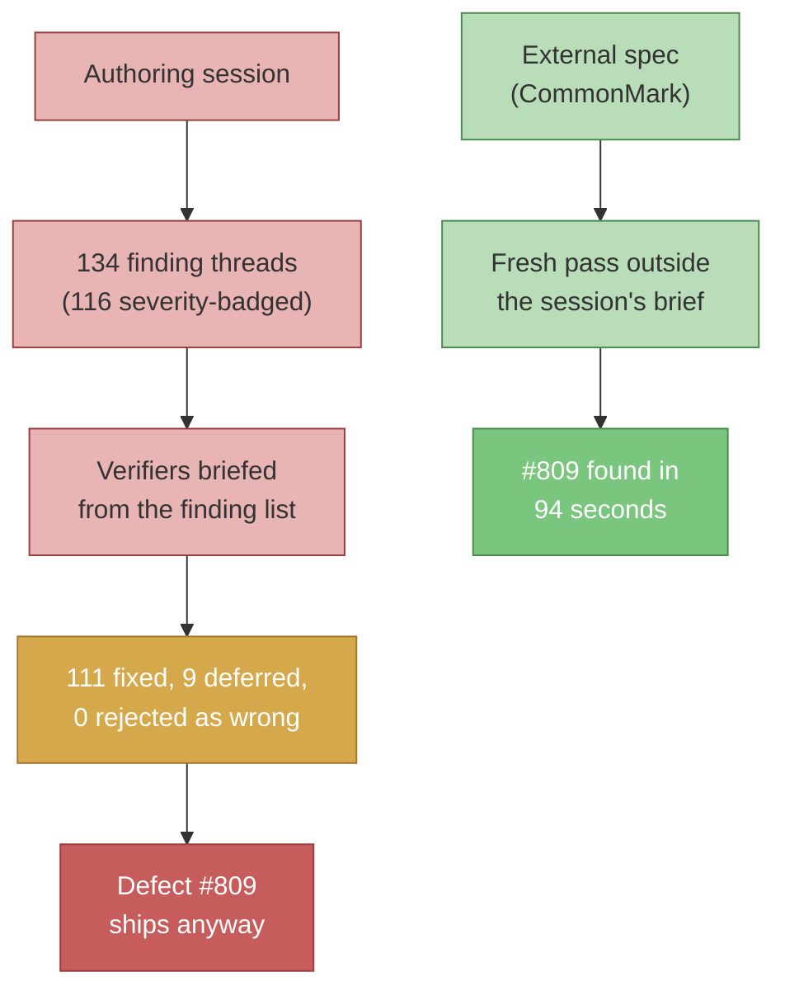

On July 30, 2026, at 03:59:00 UTC, [PR #797](https://github.com/nathanjohnpayne/mergepath/pull/797) merged into [mergepath](https://github.com/nathanjohnpayne/mergepath). It was the last of a nine-PR backlog batch that had been under continuous automated review for about twenty-four hours, and it went out clean: every required check green, every review finding dispositioned, the external reviewer's approval posted on the exact head.

At 04:00:34 UTC—ninety-four seconds later—a reviewer that had been rate-limited out of most of the batch finished a from-scratch pass on the merged PR and posted [one more finding](https://github.com/nathanjohnpayne/mergepath/pull/797#discussion_r3679855498). It opened: "Indented list/paragraph lines are blanked as code, and no test would catch it."

That finding became [issue #809](https://github.com/nathanjohnpayne/mergepath/issues/809), a post-merge hotfix, and the subject of this post. Because the interesting thing is not that a bug shipped. Bugs ship. The interesting thing is what the review record looked like at the moment it shipped: 134 top-level finding threads across the batch, 116 of them severity-badged, and of the 122 threads with a recorded disposition, not one rejected as factually wrong. By the only metric the process records, the review was perfect. And the metric was measuring the wrong axis.

This is the third beat of an arc this blog has been walking all year, and it is a reversal. In [Six PRs, One Bug](/blog/six-prs-one-bug-agent-failure-modes/) (April), an agent made competent local progress inside the wrong model for six straight PRs because nothing forced a repeated local failure to become a structural question. In [Agent Approval Workflow](/blog/agent-approval-workflow-genesis-of-mergepath/) (two weeks later), I built the enforcement infrastructure in response—multi-identity review, external-review thresholds, merge gates agents cannot talk their way past—on the premise that agent reliability is an infrastructure problem. This time the infrastructure ran at full power, produced the best-looking review record the repo has ever generated, and the bug shipped anyway. The failure was not that the machinery was weak. It was that the passes were correlated: layer after layer was, to a first approximation, answering the same question.

## The defect that got out

PR #797 added a new CI check: a canonical doc may not link to a hub-only doc by repo-relative path. To scan only rendered prose, it introduced a Markdown preprocessor, `mp_markdown_renderable_text`, that blanks code before scanning. The preprocessor treated every tab- or four-space-indented line as an indented code block.

CommonMark does not work that way. Indented code cannot interrupt an open paragraph or list item—a four-space-indented line inside a nested bullet is list content, not code. So a nested bullet indented four spaces—`- See [the audit](coderabbit-audit.md)`—was silently blanked before the scan ran, and the check went blind to exactly the links it existed to catch. Fail-open, with a test matrix that—in the words of the finding—"only exercises fenced and inline code, so nothing fails today."

PR #797 was not under-reviewed. It absorbed 27 severity-badged findings from the Codex GitHub App across eight review rounds, two large CodeRabbit reviews before the rate limits hit, and five substantive reviews from the Phase 4b external reviewer—four approvals dismissed by subsequent pushes before the fifth stuck. Twenty commits. Every finding on it dispositioned. And then it merged, and ninety-four seconds later CodeRabbit—which had spent much of the batch rate-limited, and was therefore reviewing the merged diff from outside the batch's conversation—read the preprocessor against CommonMark's published rules and found the hole.

I filed [#809](https://github.com/nathanjohnpayne/mergepath/issues/809) one minute later. [PR #810](https://github.com/nathanjohnpayne/mergepath/pull/810) fixed it with explicit CommonMark text-flow state tracking and merged at 04:28:05 UTC—twenty-eight minutes from finding to merged fix, with 93 regression cases behind it. (Severity taxonomy footnote, since I am being precise: CodeRabbit tagged the finding "Functional Correctness / Major"; the repo's own approval record for the fix calls it "the P1 from #797." Same defect, two vocabularies.)

## The scoreboard, re-derived

The [backlog](https://github.com/nathanjohnpayne/mergepath/issues/774) behind the batch was almost comically self-referential: seven issues, most of them defects in mergepath's own review and enforcement machinery—branch protection that had [drifted to decoration on most of the fleet](https://github.com/nathanjohnpayne/mergepath/issues/774), a test fixture [writing a fake git identity into the real repo's `.git/config`](https://github.com/nathanjohnpayne/mergepath/issues/777), a [drift guard that silently skipped quoted entries](https://github.com/nathanjohnpayne/mergepath/issues/785). Nine PRs went up as one batch—[#789](https://github.com/nathanjohnpayne/mergepath/pull/789) through [#797](https://github.com/nathanjohnpayne/mergepath/pull/797), later joined by [#800](https://github.com/nathanjohnpayne/mergepath/pull/800)—authored by my Claude agent and pushed through every review lane the repo has: the Codex App auto-reviewing each new head, CodeRabbit as the advisory second opinion, the automated Phase 4b external reviewer posting merge-gating reviews, and, new for this batch, independent adversarial verifier agents re-running each PR's "is this test actually testing anything" experiment before approval.

Here is where I have to be careful, because this batch taught me—twice, painfully—that agent-written summaries do not survive contact with the underlying record. So none of the following numbers come from a summary. I pulled the raw review objects from the GitHub API and counted, and I am keeping every denominator explicit, because the first draft of this post did not and the numbers quietly drifted between sentences.

Across the ten batch PRs and the hotfix, the record contains 268 inline review comments forming 134 top-level finding threads. Of those threads, 116 are severity-badged findings from the Codex App—12 P1, 102 P2, 2 P3—and 18 are actionable CodeRabbit comments. The Codex App alone ran 41 review rounds against 48 trigger comments; the automated Phase 4b adapter ran 13 more loops on top.

The per-finding dispositions are recorded as machine-readable markers on each thread, so the outcome is countable rather than a vibe. Over all 134 threads:

| Disposition | Threads |
|---|---|
| Fixed (marker names the fix commit) | 111 |
| Deferred to a filed follow-up issue | 9 |
| Rebuttal recorded | 2 |
| No marker | 12 |

The two rebuttals are worth a sentence, because they are the entire "the reviewer was wrong" column and they are not even that: both are on [PR #796](https://github.com/nathanjohnpayne/mergepath/pull/796), both decline CodeRabbit suggestions against a generated mirror file whose provenance header says `do_not_edit: true`. Process objections, not factual ones. Among the 122 threads with a recorded disposition, no finding was rejected as incorrect. Not one. The 12 unmarked threads are the asterisk on that record—8 CodeRabbit threads that never got markers, and 4 Codex findings that landed on [PR #790](https://github.com/nathanjohnpayne/mergepath/pull/790) nine minutes after it merged, with no disposition at all. Perfect records usually have a footnote like this.

A skeptical reading of "nothing was rejected" is that the findings were soft and accepting them was cheap. The record says otherwise: the reviewers caught real, nasty things, including an entire genre of defect I have started thinking of as the impossible-world fixture.

## Six fixtures that modelled an impossible world

Six times inside this one batch, a fixture or guard was found to be passing by encoding a belief about the world instead of the world. Three of them are worth spelling out:

**A `gh` stub that put error bodies on the wrong stream.** The test stub for a failed metadata read wrote the HTTP error body to stderr. Real `gh api --jq` writes the error body to stdout—verified live in [commit 53ae3c1](https://github.com/nathanjohnpayne/mergepath/pull/796/commits/53ae3c1ead45ceabced2d3a121df0e7e033835fd), which notes two pre-existing tests "were green against a failure mode gh does not produce." That one stream swap was hiding the failure path that later became [issue #799](https://github.com/nathanjohnpayne/mergepath/issues/799): fifteen call sites inferring failure from empty output, all of whose guards were dead.

**A consumer model that stripped too much.** The safety net simulating downstream consumer repos removed more hub paths than any real consumer lacks. As [PR #800](https://github.com/nathanjohnpayne/mergepath/pull/800) put it: "Stripping more than a real consumer lacks makes 'both-absent' skip branches fire in simulation that never fire in reality—so a wrong model produces a *passing* test, not a failing one."

**A scanner whose documentation exempted itself.** The identity-hygiene scanner's exemption matched its marker anywhere on a line. All three docs describing the check spell the marker out, so each doc exempted itself—"leaving the paragraphs whose job is to record the forbidden shape the only paragraphs never scanned" ([commit 6a2fbe5](https://github.com/nathanjohnpayne/mergepath/pull/795/commits/6a2fbe5ff3)).

The other three are the same species in miniature:

| The encoded belief | The reality | Where it was caught |
|---|---|---|
| A count guard's claim fits on one line | The guarded comments hard-wrap at ~72 columns; one of two surfaces wrapped mid-phrase and was never checked | [#797, commit 42771ef](https://github.com/nathanjohnpayne/mergepath/pull/797/commits/42771ef80f) |
| A source tree can have no hub-only doc entry | A sibling CI check already makes that shape impossible; three fixtures modelled it anyway | [#797, commit 5ac7b2f](https://github.com/nathanjohnpayne/mergepath/pull/797/commits/5ac7b2faa6) |
| A literal-text regex enrolls every wrapper in the residue guard | A wrapper with any other dependency shape produced an empty set and silently skipped enrollment | [#800, commit e53cee9](https://github.com/nathanjohnpayne/mergepath/pull/800/commits/e53cee920c) |

All six were caught inside the batch, by the batch's own verification. Which is exactly what makes the seventh—the CommonMark preprocessor above—instructive: it was the same species of defect, a wrong model of an external reality encoded into a scanner, and it was the one the session could not see.

## Why the tenth look missed what the first fresh look found

My diagnosis, written into [the batch retrospective](https://github.com/nathanjohnpayne/mergepath/issues/813#issuecomment-5133940688) the same day, is the spine of this post:

> same-session verification converged on the implementation's assumptions: the verifier agents were briefed from the authoring agent's finding list using its taxonomy, so they searched the space that session had already mapped. Every round asked the same question.

Look at the mechanics. The adversarial verifiers this batch added were real and they earned their keep—one of them returned a *blocking* verdict on [PR #791](https://github.com/nathanjohnpayne/mergepath/pull/791) and forced a fix before merge. But they were briefed by the authoring session, from its finding list, in its taxonomy. Their job was to check whether each claimed fix actually fixed the claimed defect, and whether each test actually failed when the fix was reverted. They did that job thoroughly: 111 threads closed against named fix commits, zero findings rejected as wrong.

What none of them was positioned to do was ask a question nobody in the session had thought to ask. The session's model of `mp_markdown_renderable_text` was "indented lines are code." Every reviewer briefed inside that session inherited the model along with the brief. Verification validated the fixes against the finding list; nobody re-derived the finding list against the CommonMark spec. The ten-plus passes on #797 were deep, and they were largely deep in the same hole.

The reviewer that found the escape sat outside that loop—not by design, but by accident of a rate limit. I cannot prove what context it did or did not carry; what I can say is that it was never briefed from the session's finding list, and that its finding is exactly the shape a spec-first reading produces: it checked the preprocessor's behavior against CommonMark's actual block rules and asked the one question the session never had—*does CommonMark let indented code interrupt a list item?*

Here is the reframe I keep coming back to, and I want to state it with the right words this time. A perfect disposition record measures how completely you closed the findings raised. It says nothing about the defects nobody raised. Closure and coverage are different axes. The batch's zero-rejections record looked like rigor, and it was—but it was rigor on the closure axis, over a question set that was fixed at briefing time and never expanded. The metric could not even represent the failure that mattered, so of course it did not move when the failure shipped.

## The natural experiment: where the matrix comes from

The same batch contains a smaller version of the same event, and this one has a control-ish structure that makes the mechanism visible—a natural experiment, not a controlled one, but worth taking seriously.

[PR #796](https://github.com/nathanjohnpayne/mergepath/pull/796) includes a Bash reimplementation of the pattern matching GitHub uses for branch-protection refs, which GitHub documents as Ruby's `File.fnmatch` with `File::FNM_PATHNAME`. The authoring agent did the right thing by every standard I had before this batch: it wrote a differential test that extracts the matcher verbatim and runs every pattern/ref pair through real Ruby, asserting agreement. Its matrix had 168 author-written pairs. It passed.

The Phase 4b external reviewer, before approving, did not re-run that matrix. It extended it—adversarially, from the spec's behavior rather than from the author's cases. In [its own words](https://github.com/nathanjohnpayne/mergepath/pull/796#pullrequestreview-4814414033): "I found the trailing-slash fnmatch mismatch, added adversarial matrix coverage first (66 passed / 1 failed with 14 Ruby-vs-Bash mismatches), then applied the two empty-component preservation lines." The root cause was four lines from the bottom of the harness: `IFS='/' read -r -a` silently drops a *trailing* empty field, so `release/*/` collapsed into `release/*`—crediting matches Ruby denies. The [fix commit](https://github.com/nathanjohnpayne/mergepath/pull/796/commits/016336a360054a626e8ac8f6212b8ce4fa81917d) is two `case` statements re-appending the empty component, under a comment stating the rule. The matrix merged at 255 pairs, seventeen patterns by fifteen refs, bracket classes included.

Same harness, same reference implementation, same technique, executed competently both times. The author-derived matrix passed a broken matcher; the spec-derived expansion failed it within one round. I will not claim the matrix provenance was the *only* variable—the author and the reviewer were different agents with different prompts and different context, and nothing here was randomized. But the episode is exactly consistent with the convergence diagnosis, and the direction is the same as #809's: the author's pairs came from the same place the author's implementation came from, so they shared its blind spots by construction. A trailing slash was not in the implementation's model of a ref, so it was not in the matrix either.

And one more turn of the screw, because this batch does not let anyone off. The retrospective comment I quoted above—the one containing the diagnosis, written by the agent that drove the batch—cites this very example as "1041 pattern/ref pairs." I went looking for the 1041. It does not exist. The matrix was 168 pairs, then 224 at the moment the mismatch was found, then 255 at merge; the only "1041" anywhere in the PR's record is a line number in a `sed -n '1041,1560p'` command inside a handoff comment. The comment diagnosing that verification inherits unexamined assumptions itself carried an unverified number, and I only know because I re-derived it. I am leaving that in the post rather than quietly correcting it, because it is the phenomenon, demonstrated on the sentence describing the phenomenon.

## A footnote on volume

One more distortion in the batch's numbers deserves a short note, because it inflates every count above. Mergepath's branch protection sets `required_status_checks.strict: true`, so every merge forces every other open PR to update from `main`; the review workflow auto-triggers a fresh review on every new head; and `gh pr update-branch` mints a new head even when it changes no file content. As [issue #798](https://github.com/nathanjohnpayne/mergepath/issues/798) puts it: "With N open PRs the train costs O(N²) review rounds in the worst case, none of which are responding to an actual code change." This was measured, not inferred—on [PR #794](https://github.com/nathanjohnpayne/mergepath/pull/794), the driving agent posted exactly one review trigger and the workflow manufactured the rest, including a round that produced a P1 and two P2s against a head whose content had not changed. The cure already existed unused: the merge gate has computed a content fingerprint for exactly this case since [#705](https://github.com/nathanjohnpayne/mergepath/issues/705), and it was observed working elsewhere in this same batch. So when you read "41 review rounds," know that an unquantified but real fraction of them were the system reviewing its own head-churn. Round count is not just the wrong unit for review quality; some rounds were barely reviews of anything at all.

## The correction, and its honest limits

The fix that generalizes is not "add more review." The batch had review to spare. The fix is to change where at least one reviewer's question set comes from: for any component with an external specification, derive the test matrix from the spec, not from the session's findings. The retrospective states it as a constraint: "at least one pass must derive its test matrix from the external specification rather than from prior findings." That constraint would have caught #809—`mp_markdown_renderable_text` is an implementation of CommonMark's block rules, and CommonMark's rules are written down and executable; the [#810 fix](https://github.com/nathanjohnpayne/mergepath/pull/810) is, in effect, the preprocessor finally being tested against them. The one time a reviewer applied that constraint in this batch, it caught the fnmatch bug. A pass cap, a round budget, or an approval count would have caught neither, because all of those were satisfied while the defect shipped.

I want to be honest about how partial this correction is. It works where a spec exists—CommonMark, `File::FNM_PATHNAME`, an RFC, a documented API. Much of mergepath is not that. It is policy prose interpreted by non-deterministic readers, and [#813](https://github.com/nathanjohnpayne/mergepath/issues/813), the epic now trying to bound this whole loop, names that as the deep problem rather than pretending to solve it: "Adding prose to clarify a prose rule does not converge, because each clarification is new surface to misread. This property is real and is bounded only by how much of the spec becomes executable. No item below eliminates it; the items shrink its domain. Any plan that claims to remove it is wrong." A blog post claiming otherwise would be wrong too. Spec-derived review shrinks the domain of the convergence failure; it does not and cannot eliminate it, because you cannot derive a matrix from a spec that only exists as prose in the heads of its readers.

There is one more datum pointing the same way, and I will state it with the caution it deserves: when the #813 epic itself was reviewed, two production bots read its 91,000 characters and produced zero findings, while three independently-briefed adversarial reviewers produced 38 defects—six of them fatal—on the same text an hour earlier. Different tools, different tasks, different briefs, so this is a data point and not a comparison. But the direction rhymes with everything else in this post: the output gap tracked the brief, not the horsepower.

Which leaves the question I do not have an answer to, and the reason #813 is an epic and not a patch. The repo is about to put a budget on review, because this batch demonstrated that unbounded review does not terminate on its own—findings per pass never decayed; fixing generates new findable surface. But a budget needs a unit, and every unit on the table is a count—passes, rounds, findings, approvals—and this batch just showed that a count optimizes toward spending every pass inside a single frame, which is exactly the failure mode made economical. Passes are not fungible; three passes from independent framings are worth more than ten from one. I know how to count passes. I do not yet know how to count frames.
