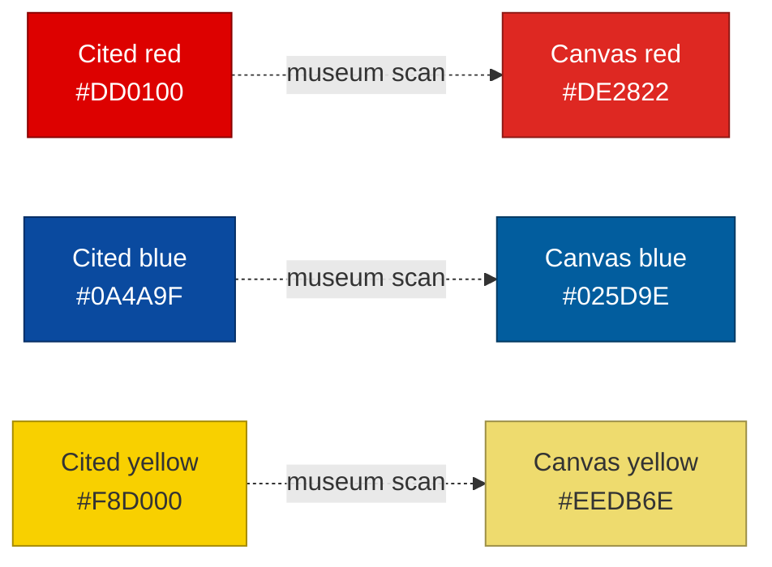
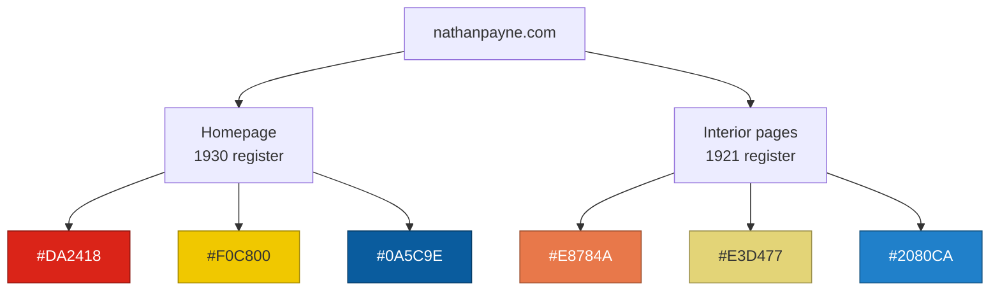

On June 11, 2026, I handed Claude two screenshots of my [projects page](/projects/) and one sentence: scrutinize this layout against Mondrian colors and design principles. I expected an opinion. The page quotes Mondrian openly—black lattice, colored planes, cream field—and I wanted to know how well the quotation held up. What I expected back was the kind of critique a design-literate colleague gives you: some adjectives, a reference or two, maybe a suggestion about proportions.

What I got back was a Python script. Claude loaded the screenshots, bucketed the pixels, and pulled exact hex values for every plane on the page before saying a word about design. The critique that followed was built on measurements, and that one move—data before adjectives—set the tone for everything that happened over the rest of the project. By the end, the work had produced two museum-grade color verifications, two tickets, one palette architecture, and a correction record in which the most confidently wrong source was not my CSS and not my screenshots. It was the model.

## The finding: two blues in one composition

The sampled palette told a story I half knew and half did not. The red came back as `#C01D18` on both screenshots—consistent, which meant my token discipline was holding there. The yellow came back as `#D9B314`, which Claude called mustard rather than cadmium, a value step down from anything Mondrian painted. And the blues came back as two different colors: `#224089` on the [Mergepath](/projects/mergepath/) plane and `#2280CA` on the [Friends & Family Billing](/projects/friends-and-family-billing/) plane. An ultramarine and a cerulean, sitting in the same composition.

The verdict was direct: Mondrian never ran two blues in a single painting. Within a composition, each primary appears at exactly one hue. Claude's diagnosis was that the cerulean looked like token drift—two blues that probably arrived in different PRs rather than a deliberate choice—and the prescription was to keep the ultramarine and kill the cerulean. It also ranked my red as "matching neither era": too dark for the 1930s cadmium, too red for anything earlier. Hold that claim; it gets half retracted later, and the retraction is the most interesting part of this story.

There was a structural critique too—the page reads as rows wearing a Mondrian skin, every horizontal gutter slicing the full width, all the saturated color hugging the right rail—but the structural work deserves its own ticket and its own post. This one is about the colors, because the colors are where the argument happened.

## The counter: I had a source

The drift diagnosis was wrong, and I could prove it. The cerulean was not an accident. It was sampled from a specific painting: [*Composition with Large Blue Plane, Red, Black, Yellow, and Gray*](https://dma.org/art/collection/object/4348683), 1921, Dallas Museum of Art. I sent Claude a poster reproduction of it.


Claude sampled the poster the same way it had sampled my screenshots and conceded the point with interest. The poster's blue read `#028DE2`—my `#2080CA` was a slightly tempered but defensible match. And the concession went further than I pushed it: the same painting's field planes are cool grays around `#D8D8E0`, which is nearly exactly the `#DDE1E5` gray-blue plane Claude had dinged, and its black plane samples as soft charcoal, not far from the `#333333` I use. Three of the audit's "violations" turned out to have citations.

But the critique did not dissolve. It transformed, and the transformed version was sharper than the original. The problem was never any single hue—it was that I was citing two paintings in one composition. The ultramarine belongs to Mondrian's 1930s register. The cerulean, the gray-blue, and the charcoal belong to 1921. Each painting is internally consistent: the 1921 canvas pairs its cerulean with a vermilion orange-red and a pale lemon yellow, not with a brick red and a mustard. A viewer sees the provenance in neither case. They see one composition whose planes disagree with each other.

Provenance is invisible at render time. Coherence is the only thing that survives to the screen. That sentence is the design principle I took away from the whole exchange, and it generalizes well past Mondrian: a sourced decision and an accidental one look identical in the browser if the result is incoherent either way.

## The page is the unit of consistency

The resolution was not to pick a winner. It was to notice that the unit of compositional consistency is the viewport, not the site. A museum hangs the 1921 and the 1930 canvases in different rooms, and nobody calls that incoherent. So the site got rooms: the homepage keeps the high-chroma circa-1930 register, and every interior page—projects, blog, resume, anything added later—moves to the softer 1921 register. No page mixes. That is the entire rule.

The functional logic runs the same direction. The homepage is a poster: high impact, low text, the place where the instant "Mondrian" recognition needs to land. The 1930 primaries earn their chroma there. Blog and project pages are reading surfaces, and 1921's quieter cerulean, vermilion, and lemon sit next to body text without shouting at it. There is even an honest conceit available: finished statement out front, working-period palette where the process and the writing live. Form maps to content. If anyone asks why the blog looks different from the homepage, that is the answer, and it is true.

## What the built CSS knew that I did not

Before writing the change, Claude pulled the production stylesheet and audited it—not my source repo, the actual shipped artifact at the CDN edge. The first thing it found was that my two blues were not just two colors. They were two tokens, sitting side by side in `:root`:

```css
--blue: #223f89;
--lightblue: #2080ca;
```

Deliberate, exactly as I had said. But the audit kept going, into the places a hex grep cannot see. The `.post-card` hover ring baked ultramarine into an eight-digit alpha hex: `#223f892e`, blue at roughly 18% opacity. Search the shipped CSS for `223f89` and you find it; search for the token's consumers and you do not, because it is not consuming the token. Worse, four `[data-accent=*]` scopes defined `--accent-soft` as `rgba()` literals with the plane colors baked in numerically—`rgba(34, 63, 137, .12)` and friends. Those are invisible to any hex search and would have silently survived a token remap, shipping a mixed register through the back door of the exact feature meant to prevent one.

The audit also corrected itself twice along the way, which matters for the record. Its first pass claimed `#223F89` was hardcoded twice; the second occurrence was actually the alpha variant, a different and more dangerous finding. Its first pass claimed the gray-blue `#DDE1E5` had no token behind it; the deeper pass found a whole per-scope `--project-bg` system that the three raw usages were bypassing. Both corrections came from the same prompt: I asked it to verify its own extraction before I would accept a ticket built on it. The errors were real, the corrections were real, and neither would have surfaced without the demand.

The best discovery was architectural. My pages already carry `data-accent` attributes that redefine `--accent` and `--accent-soft` per scope. The theming machinery the palette split needed was not new work. The codebase had already voted for the solution; it just had not been asked the question.

## Make the model cite its sources

Here is where the project earned its title. The palette ticket needed target values for the 1930 register, and Claude supplied them from memory: red `#DD0100`, blue `#0A4A9F`, yellow `#F8D000`—the "commonly cited screen approximations" of classic Mondrian. I asked one question before accepting them: did you confirm these anywhere beyond the two images I provided?

The honest answer was no. My site's colors had been verified against the live CSS, which is ground truth. The 1921 palette traced to exactly one source, my marketing poster. And the 1930 values traced to nothing but training data. So Claude went and got primary sources: the Dallas Museum of Art's official digitization of the 1921 painting (accession 1984.200.FA) and a high-resolution scan of [*Composition II in Red, Blue, and Yellow*](https://collection.kunsthaus.ch/en/collection/item/2455/), 1930. It sampled both with robust medians across the plane pixels—468,315 of them for the 1930 red alone—to rule out highlight artifacts.


The 1921 results vindicated my poster. Museum blue `#0383E3` against the poster's `#028DE2`: nearly identical. The gray plane read `#DADFE5` against my `#DDE1E5`: inside the noise. The black plane sampled `#323137`, which means the `#333333` token I have been running since the beginning was museum-accurate the entire time, and a planned change to it got deleted from the ticket.

The 1930 results dismantled the model's own numbers. The actual red is `#DE2822`—visibly orange-leaning, with a real green channel, nothing like the pure `#DD0100` it had cited. Which means my brick `#C11D19`, the one that "matched neither era," was hue-correct for 1930 all along and merely dark. The blue sampled `#025D9E`, distinctly more cyan than the violet-leaning `#0A4A9F`. And the canvas yellow read `#EEDB6E`—soft, aged cadmium, nowhere near the `#F8D000` of pop-culture Mondrian, because a century of paint chemistry has opinions that posters do not.



The least reliable data in the entire exercise was the model's memory. Not my CSS, not my screenshots, not even my marketing poster. The confidently recalled canonical values were the ones that did not survive contact with a primary source. The fix was not a better model; it was a procedural habit. Ask where a number came from. If the answer is "everybody cites it," make the agent go find the object.

## Two tickets, four decisions

The work shipped as two tickets in strict sequence—[#497](https://github.com/nathanjohnpayne/nathanpaynedotcom/issues/497) and [#498](https://github.com/nathanjohnpayne/nathanpaynedotcom/issues/498)—and the sequencing is the part I would defend hardest. The first, shipped as [PR #499](https://github.com/nathanjohnpayne/nathanpaynedotcom/pull/499), changed zero rendered pixels: pure plumbing that routed every palette color through a custom property and re-derived every baked wash from its token. Because nothing visible was allowed to change, the acceptance criteria could be brutal and mechanical—grep for `dde1e5` and get exactly one match, grep for baked `rgba()` plane literals and get zero. A refactor with falsifiable acceptance criteria is a refactor an agent can verify itself against.

The second, shipped as [PR #500](https://github.com/nathanjohnpayne/nathanpaynedotcom/pull/500), was the values diff the plumbing made safe: 1921 as the `:root` default, one `[data-palette="1930"]` override block, the homepage as the single page that opts in. Every judgment call—the homepage black plane, the interior blue, the wash derivation, the token retirement—was an explicit decision checkbox with a recommendation prefilled, and the one genuinely risky item, a contrast audit for accent-colored text on cream, got its own line and found real cases. The agent does the plumbing. I ratify the judgment. That division of labor is the whole trick, and the checkbox format makes it enforceable instead of aspirational.

## Auditing the shipped site

Both tickets are live, and the post-ship audit of the production CSS came back green across the board. `#dde1e5` appears exactly once, as the token definition. The old `#223f89` is gone entirely. Zero baked `rgba()` plane literals. Seventy-four `color-mix()` usages where hand-baked values used to live (the source carries seventy-six; the minifier precomputes two—exactly the source-versus-artifact gap this exercise was about). The `:root` carries `#E8784A`, `#E3D477`, and `#2080CA`; the override scope carries `#DA2418`, `#F0C800`, and `#0A5C9E`—the museum-derived values. Even the loose end I expected to become the punch list was already handled: the OG images regenerated per register ([PR #504](https://github.com/nathanjohnpayne/nathanpaynedotcom/pull/504)), the homepage card sampling the 1930 set and the projects card sampling vermilion, lemon, and cerulean, with cache-busting params on both.

There are still two blues on the site. One per room.



## What I generalized

Ask for data, not adjectives. An agent with a filesystem and an image library turns a taste argument into a measurement in about four seconds, and everything downstream of a measurement is a better conversation than everything downstream of a vibe.

Make the model cite its sources, especially when it sounds most certain. The canonical Mondrian hexes arrived with the confidence of a textbook and the sourcing of a rumor; one verification prompt produced two self-corrections and a museum scan that overturned three values. The failure mode was never the model being wrong—it would have been shipping its memory unexamined.

Audit the built artifact, not just the source. Drift hides where greps cannot see—alpha channels, `rgba()` triplets, values baked at authoring time. The production stylesheet knew things about my color system that no search of the repo would have surfaced.

Sequence the refactor before the change, and keep judgment separate from plumbing. A zero-pixel ticket with grep-able acceptance criteria is the cheapest insurance in this workflow, and decision checkboxes with prefilled recommendations meant the agent never had to guess what I wanted—or I to review whether it had guessed right.

And keep the design principle the argument itself produced: coherence beats provenance. A choice you can cite and a choice you cannot are indistinguishable on screen. The viewer gets the composition, not the footnotes.

One critique, one counter-painting, two museum scans, two self-corrections, two tickets, four decisions. The argument started with an agent telling me my deliberate choice looked like a bug. It ended with the agent's own canonical knowledge overturned by a primary source, and a color system that can prove its own consistency with a grep.
